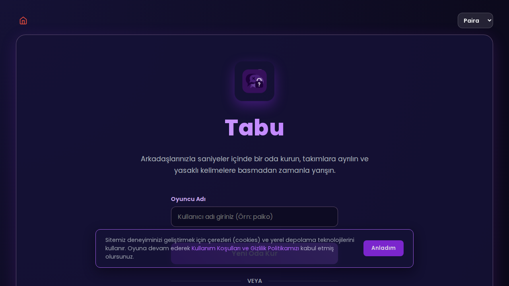
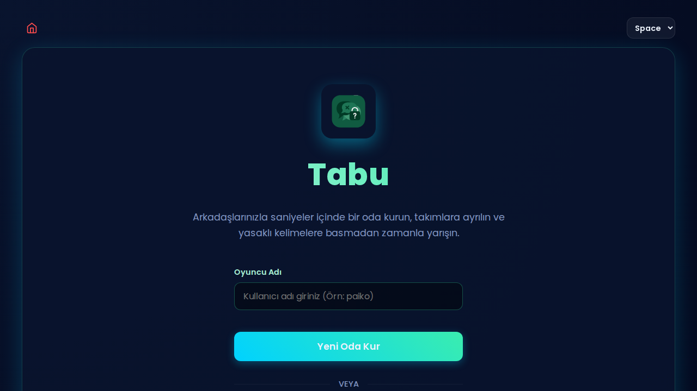
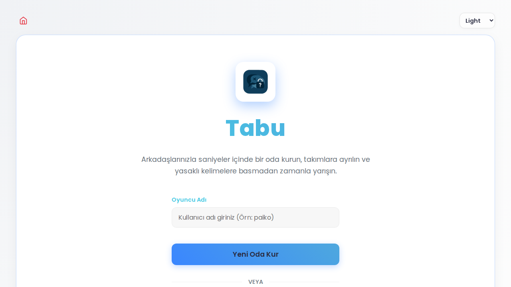
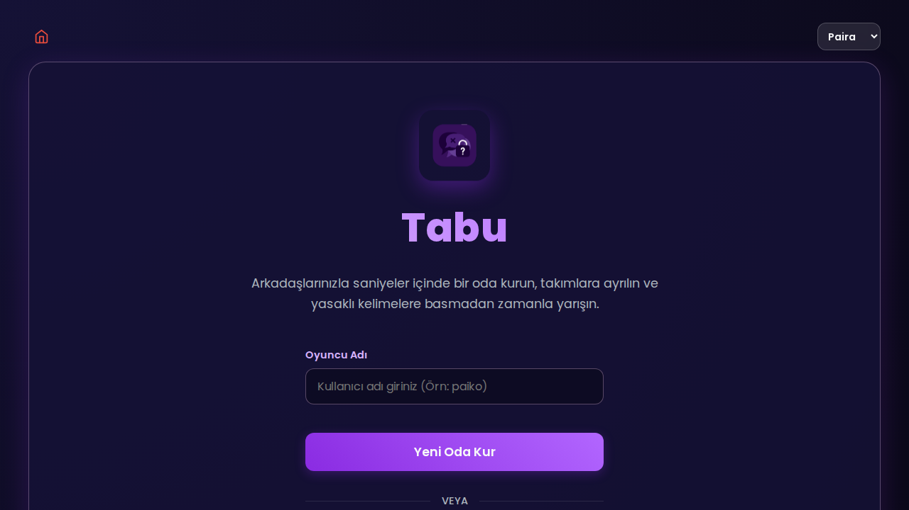

# Paira Games - Yeni Oyun Geliştirme Rehberi

Bu belge, Paira Games platformuna yeni bir oyun eklemek isteyen geliştiriciler için mimari yapıyı, tema sistemini ve network (ağ) mantığını açıklamaktadır. Mevcut oyunlar (örneğin: Tabu) bu standartlara göre geliştirilmiştir.

---

## 1. Genel Mimari: "Engine-View-Network"
Platformdaki oyunlar, kod karmaşıklığını önlemek için üç ana parçaya ayrılır:
- **Engine (Motor):** Oyunun saf mantığı. DOM'dan bağımsızdır. Skor takibi, tur yönetimi ve kurallar burada tutulur.
- **View (Görünüm):** Kullanıcının gördüğü arayüz. Buton tıklamaları, ekran geçişleri ve DOM güncellemeleri burada yapılır.
- **Network (Ağ):** Oyunun diğer oyuncularla senkronize edilmesini sağlar. `PeerNetworkManager` kullanarak veri alışverişini yönetir.

---

## 2. Shared Klasörü ve Ortak Özellikler
`shared/` klasörü, tüm oyunların uyması gereken temel yapı taşlarını içerir.

### A. Tema ve Layout (`shared.js` & `shared.css`)
Platformda üç ana tema bulunur: **Paira (Varsayılan), Space ve Light.**

| Paira (Varsayılan) | Space | Light |
| :---: | :---: | :---: |
|  |  |  |

- **Tema Yönetimi:** Tema, `<html>` etiketine eklenen `data-theme="space"` gibi bir attribute ile kontrol edilir. CSS değişkenleri (`--primary-purple`, `--bg-deep` vb.) bu temaya göre otomatik güncellenir.
- **Otomatik Injection:** `shared.js` dosyası her sayfada bulunmalıdır. Sayfa yüklendiğinde; üst menü, sol menü, footer ve tema seçiciyi otomatik olarak sayfaya enjekte eder.
- **Layout:** Oyunların ana konteyneri `.glass-panel` sınıfını kullanmalıdır. Bu sınıf, platformun karakteristik şeffaf/buzlu cam görünümünü sağlar.

### B. Networking (`peer_manager.js`)
Oyunlar P2P (Peer-to-Peer) mantığıyla çalışır. Sunucu üzerinden değil, oyuncular arasında veri aktarılır.
- **PeerNetworkManager:** Bu sınıf, PeerJS üzerine kurulu kolaylaştırılmış bir yapıdır.
- **Host Mantığı:** Odayı kuran kişi "Host" olur ve oyunun otoritesidir. Oyunun durumunu (state) o yönetir ve diğer oyunculara ("Client") yayınlar.
- **Veri Gönderimi:** `network.broadcast({ type: 'GAME_START', data: {...} })` ile tüm oyunculara bilgi gönderilir.

### C. Yardımcı Araçlar
- **PairaTime:** `window.PairaTime.now()` ile tüm oyuncularda senkronize zaman bilgisi alınabilir.
- **PairaAudio:** `window.PairaAudio` üzerinden standart ses efektleri (başarı, hata vb.) çalınabilir.

---

## 3. Örnek: Tabu Oyun Yapısı

Tabu oyunu incelendiğinde şu yapı görülür:
1. `index.html`: Lobinin ve oyun ekranının iskeleti.
2. `index.js`: Başlangıç ayarları.
3. `game.js`: `TabuGameEngine` ve `TabuView` sınıflarının tanımlandığı ana dosya.
4. `network.js`: `TabuNetworkManager` ile ağ trafiğinin yönetimi.

---

## 4. Yeni Oyun İçin Adımlar
1. **Klasörleme:** `OyunIsmi/` klasörü oluşturun.
2. **HTML:** `shared.css` ve `shared.js` dosyalarını mutlaka dahil edin. Ana içeriği `
` içine alın.
3. **CSS:** Kendi stillerinizde sabit renkler yerine `var(--text-color)` veya `var(--primary-purple)` gibi CSS değişkenlerini kullanın.
4. **Networking:** `PeerNetworkManager`'ı başlatın. "Host" ve "Client" rollerine göre farklı mantıklar kurun (Örn: Sadece Host kart çekebilir, sonucu herkese gönderir).
5. **Zamanlama:** Geri sayım gibi işlemler için `window.PairaTime` kullanarak tüm oyuncuların aynı süreyi gördüğünden emin olun.

---

Bu yapıya sadık kalmak, oyunun platformun genel görünümüyle tam uyumlu olmasını ve hata payının azalmasını sağlar.
